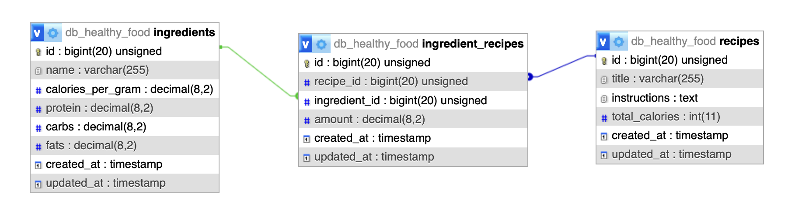

Healthy Food API 
This is a professional RESTful API built with Laravel 11 designed to manage healthy recipes and calculate nutritional data automatically. It features a many-to-many relationship between recipes and ingredients, with built-in logic for nutritional health labels.

 Features
Authentication: Secure login and logout using Laravel Sanctum (Bearer Tokens).

Nutritional Engine: Automatically calculates total calories, proteins, fats, and carbs for each recipe.

Smart Labeling: Categorizes recipes as "High Protein", "Low Calorie", or "Low Fat" based on nutritional thresholds.

Data Integrity: Implements detach() on deletion to prevent orphan records in the database.

Database Seeding: Includes ready-to-use healthy ingredients and recipes for testing.

 Tech Stack
Framework: Laravel 11

Language: PHP 8.2+

Database: MySQL

Tools: Postman (API Testing), Composer, Artisan.

 Installation & Setup
Clone the repository:
- git clone https://github.com/lumoreiralu/api-healthy_food-laravel.git
- cd healthy-food-api

Install dependencies:
- composer install

Environment Setup:
- Duplicate .env.example and rename it to .env.
- Configure your database credentials (e.g. DB_DATABASE=db_healthy_food).
- Run php artisan key:generate.

Database Migration & Seeding:
- Run the command to set up everything:
    php artisan migrate:fresh --seed

Run the Server:
- php artisan serve

API Endpoints (Quick Overview)
Method	    Endpoint	        Access	Description
POST	    /api/register	    Public	Create a new user account.
POST	    /api/login	        Public	Obtain a Bearer Token.
GET	        /api/recipes	    Public	List all healthy recipes.
GET	        /api/recipes/{id}	Public	Detailed view with health labels.
POST	    /api/recipes	    Private	Create a recipe (Requires Token).
DELETE	    /api/recipes/{id}	Private	Delete recipe and associations.

e.g GET /api/ingredients/

e.g GET /api/recipes/

e.g POST /api/register

db-diagram

